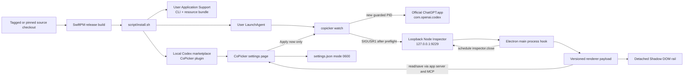

# Architecture and data flow

CoPicker is a user-scoped companion system around the official Codex desktop app. It deliberately keeps installation, automatic injection, renderer behavior, settings persistence, and model switching as separate layers so each can fail closed and be validated independently.

The accepted behavior and exact values are defined in [accepted-baseline.md](accepted-baseline.md). This document explains how the implementation produces that behavior.

## System overview



No arrow writes into the official application bundle. Every installed artifact belongs to the current user.

## Build and installed artifacts

SwiftPM produces:

- `copicker`: the native CLI, watcher, Inspector client, LaunchAgent manager, and stdio MCP server;
- `Copicker_CopickerCLI.bundle`: the processed `model-rail.js` and `copicker-settings-v2.html` resources.

`script/install.sh` performs an explicit user-authorized installation:

1. rejects `root`/`sudo` execution;
2. requires Swift, the `codex` CLI, and `/Applications/ChatGPT.app`;
3. validates `model-rail.js` with Node.js when Node is available;
4. builds a release executable;
5. runs the default read-only CoPicker status/preflight;
6. installs a stable executable and resource bundle under `~/Library/Application Support/Copicker/bin`;
7. creates and loads the opt-in user LaunchAgent;
8. copies the local marketplace/plugin package into Application Support;
9. registers `copicker-local` and installs `copicker@copicker-local` through the Codex CLI.

The source checkout is not used by the installed watcher or plugin after installation and may be archived or removed.

## Read-only default and live command boundary

Running `copicker` without a live subcommand is equivalent to `status`. It inspects:

- the official application path;
- `CFBundleIdentifier`, short version, and build;
- the executable path;
- the Electron fuse wire;
- whether a matching process is running;
- bundled CoPicker payload/settings-resource sizes and persisted preferences.

It sends no signal and opens no Inspector connection.

Commands such as `inject`, `remove`, live probes, `autostart enable/disable`, `script/install.sh`, and settings **Apply now** are separate live effects. Tests must never call them.

## Automatic injection lifecycle

The LaunchAgent starts `copicker watch` only after the user logs into the GUI session. The watcher polls for `com.openai.codex`, handles each new PID once, and returns to waiting after that process exits.

For a new PID it:

1. waits through the configured startup grace period;
2. verifies the installed app and Electron fuse configuration;
3. resolves the exact process and executable path;
4. checks Inspector port ownership;
5. sends `SIGUSR1` only after the guards pass;
6. waits for a Node Inspector target on loopback;
7. connects with a short-lived WebSocket session;
8. evaluates the versioned installer expression;
9. requires an explicit `installed: true` result;
10. schedules `inspector.close()` and closes its client session;
11. records only structured operational state.

The watcher uses finite startup recovery rather than retrying forever. Inspector timeouts may be retried only when `lsof` proves that the sole listener is the exact Codex PID signaled by the same in-memory attempt. A pre-existing, unknown, or mixed owner produces `inspector-busy` and no attachment.

## Electron main-process hook

The evaluated installer uses Electron from the existing main process and installs state under the legacy symbol `com.jonas.codex-model-rail.main-state`.

The main hook:

- keeps the latest payload source;
- attaches to current and newly created window/webview contents;
- evaluates the payload in each eligible frame after load;
- ignores destroyed, detached, cross-process, and DevTools frames;
- reuses compatible state when the same renderer version is already installed;
- replaces older renderer state when the compatibility version changes.

The legacy state key and host IDs intentionally retain the original `codex-model-rail` names. They are migration identifiers, not current product branding.

## Renderer mount contract

The renderer looks for the exact compact intelligence trigger:

```text
[data-codex-intelligence-trigger][data-composer-navigation-target="reasoning"]
```

It accepts a first-level surface only when that visible Radix/`role="menu"` surface contains both the current reasoning slider and model-picker controls. It excludes input-origin overlays and separately identifies nested model/reasoning menus as collision obstacles.

Once accepted, the renderer:

1. creates a body-level host with ID `codex-model-rail-popover-host`;
2. attaches an open Shadow DOM root;
3. renders the approved scaled rail;
4. computes a valid top/left/right rectangle outside the official surface and viewport insets;
5. observes size, window, scroll, pointer, menu, and trigger state;
6. synchronizes official selection state;
7. removes the host when the accepted lifecycle ends.

The official surface is a positioning anchor, not a parent. The Shadow DOM isolates CoPicker's CSS from Codex and prevents CoPicker selectors from styling official controls.

## Placement state machine

Placement uses a preferred base, obstacle-aware candidates, and a latched session state.

- Candidate rectangles must fit a 12-pixel viewport inset.
- The rail must not intersect the first-level picker or a recognized nested obstacle.
- Top candidates include centered, edge-aligned, and viewport-edge variants before side fallbacks.
- Left/right candidates may raise vertically when needed.
- Right placement clamps leftward if the display edge cannot fit the full rail.
- The full-width composer list remains excluded unless it contains a nested model-row surface covered by the explicit contract.

Once the rail moves to avoid a submenu, repeated DOM mutations do not reset it while its current rectangle is valid. Pointer-visited side placement can return after the submenu clears and the return timer expires; top avoidance remains latched for that open session.

## Model catalog and selection flows

The renderer uses the existing Codex `electronBridge`/app-server connection. It does not open another network listener and does not call a remote API directly.

### Catalog resolution

`model/list` is authoritative for:

- account-visible model IDs;
- official display names;
- supported effort ordering;
- the service tier whose display name is `Fast`;
- normal/default tier selection.

Only stable CoPicker row keys and display-name aliases exist in source. Account-specific IDs and tier IDs remain in renderer memory for the process lifetime.

### Existing task

When the currently open trigger's own `[data-codex-composer-root]` contains exactly one valid `[data-above-composer-conversation-id]` value:

1. CoPicker serializes the requested selection;
2. resolves current catalog IDs and availability;
3. calls `thread/settings/update` for that task;
4. waits for `thread/settings/updated` confirmation;
5. commits the rail state only after confirmation;
6. restores the last confirmed state on error or timeout.

The renderer never scans the full document for a convenient task identifier and never prefers a task ID cached from a previous composer. Every commit re-resolves the identifier from the unique currently open trigger. A trigger or primary-surface change invalidates the previous value, preventing retained background task DOM from capturing a new-composer selection.

### New unsent task

Before Codex creates an identifier for that exact current composer, CoPicker does not fabricate one, adopt another composer's identifier, or write raw config keys. It instead:

1. validates the official first-level picker structure;
2. opens the exact Model row and chooses a catalog-backed option;
3. opens the exact Effort row and chooses by official ordered position;
4. chooses the official Speed option when Fast is supported;
5. restores Codex's compact/advanced picker state;
6. requires the official trigger to display the complete expected selection.

If an option, order, or confirmation is absent or ambiguous, the no-task path fails closed. After task creation, the renderer immediately returns to the direct task settings path.

## Settings architecture

### Native plugin path

The local plugin launches the stable installed executable as `copicker mcp-server`. The private newline-delimited stdio server exposes three app-only tools:

- `copicker_settings`: read/render the authoritative snapshot;
- `copicker_settings_save`: validate and save a complete snapshot using the expected revision;
- `copicker_settings_apply`: explicit current-process application handler.

The render tool advertises `ui://copicker/settings/v2.html` with the MCP App MIME type, themed data-URI icons, and empty network/frame allowlists. All tools use `_meta.ui.visibility: ["app"]`; they are host controls, not general model-callable tools.

### Renderer fallback path

Codex build `7119` parses local settings entry metadata but may suppress it behind a remote plugin allowlist. The injected fallback:

1. detects the built-in Browser or Plugins settings navigation control;
2. yields when a native CoPicker control exists;
3. otherwise clones the native sidebar item structure and changes only the ID, icon, label, and click behavior;
4. positions a sandboxed settings iframe over the official right scroll viewport;
5. uses the same MCP tools and the same settings store;
6. removes the fallback when the native entry appears or Settings closes.

The fallback iframe is `sandbox="allow-same-origin"` without `allow-scripts`. Codex's top-level CSP blocks inline script execution in `about:srcdoc`, so the already injected parent controller owns form events and permits only the three CoPicker settings tool names.

### Persistence

`~/Library/Application Support/Copicker/settings.json` contains:

```text
schemaVersion
revision
enabled
visibleModels
preferredPlacement
appearance
```

The store normalizes model order, requires at least one visible model, increments revisions for real changes, returns the same snapshot for an idempotent save, rejects stale revisions with the current snapshot, writes atomically, and applies POSIX mode `0600`.

No browser storage is used. The settings page and renderer share this store through the installed MCP server.

## Native settings visual strategy

CoPicker cannot safely import Codex's private minified React components into both the native MCP App sandbox and injected fallback. Instead it uses three inputs:

1. local semantic HTML controls with keyboard-native checkbox/radio behavior;
2. current Codex theme/font/border/focus/shadow variables forwarded to the fallback document;
3. live official DOM/computed geometry for the page shell and local measured control primitives.

The fallback host targets the real official scroll viewport rather than guessing an inset from screenshots. The accepted measurements and implementation mapping are recorded in [accepted-baseline.md](accepted-baseline.md#accepted-native-settings-measurements).

## Appearance

Renderer appearance resolves from the persisted preference:

- `codex`: current Codex document theme;
- `system`: `prefers-color-scheme`;
- `light`: forced exact-white rail surface;
- `dark`: forced existing dark surface.

Light and dark plugin icons are separate 24-by-24 SVG assets. The rail keeps its six model gradients in both modes while changing shell, text, dot, thumb, border, shadow, and Daybreak label tokens.

## Privacy and observability

The renderer payload makes no `fetch`, XHR, cookie, localStorage, sessionStorage, or IndexedDB access. Runtime selector/catalog state disappears with the Codex process.

The watcher state and logs may contain only operational metadata such as:

- CoPicker and Codex versions;
- process identifiers;
- timestamps and phases;
- structured result/error codes.

They must not include task identifiers, DOM text from user surfaces, conversation content, composer content, authentication information, cookies, or tokens.

Scoped probes inspect only versioned control attributes and bounded selection metadata. A write-and-restore selection probe is a live mutation and must be separately authorized.

## Failure and rollback behavior

- Missing app, fuse, executable, selector, model, effort, tier, task confirmation, or settings bridge: abort/fail closed.
- Unknown Inspector listener: do not signal or attach.
- Renderer selection failure: restore last confirmed rail state.
- Stale settings save: show authoritative current values rather than overwriting them.
- Apply-now failure: retain saved preferences for the next normal injection.
- Current-process rollback: run guarded `remove` or quit Codex.
- Future automatic rollback: disable the LaunchAgent.
- Version rollback: reinstall an exact prior tag/commit, then restart Codex yourself.

See [installation.md](installation.md) for operational recovery and [validation.md](validation.md) for proof boundaries.
